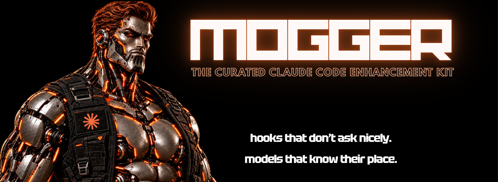

<div align="center">



<br/>
<br/>

**Most "Claude enhancer" repos are a prompt that says "be a senior engineer" and a hope.**
**This one is a bash script that says no and means it.**

[](tests/hooks.test.sh)
[](LICENSE)
[](CURATION.md)

</div>

---

Every claim in this kit is backed by an exit code, a benchmark you can
re-run, or a diff you can read — not a testimonial. Everything that didn't
clear that bar is in [CONSIDERED.md](CONSIDERED.md), with the reason,
instead of quietly not existing. That's the whole pitch: the internet is
full of "make Claude 1000x better" threads that are 80% noise. This is the
20%, with receipts, and it doesn't ask your model nicely — it puts a bash
script between it and anything that can't be undone.

## What this actually does


No config file makes the model smarter. What a kit *can* do, and what this
one does:

1. **Enforce discipline the model won't apply on its own.** Tests must
   actually pass — full suite, checked by exit code, not by the model
   saying so — before review. Scope creep is blocked at the tool call: a
   builder cannot edit a file the current task didn't declare. A "done
   when" condition that's a real check, not an adjective.
2. **Hard-gate anything irreversible.** `git push`, merges, deploys, and
   anything touching money are blocked at the tool-call level by hooks —
   no prompt, no agent, no clever reasoning gets around a bash script that
   returns exit code 2.
3. **Feed it current facts, not stale memory.** Context7 (bundled) for
   version-specific library docs. A `library-scout` agent that checks
   whether a good library already exists before anyone hand-rolls date
   math — and is explicitly allowed to answer "write it yourself," because
   a scout that always recommends a dependency is how you end up with
   forty packages for forty one-liners. A STACK.md so those choices are
   made once and stay consistent.
4. **Cut waste.** Every agent has a `model:` assignment: Haiku reads
   files, greps the codebase, and runs tests; Sonnet builds, reviews, and
   scouts libraries; only the orchestrating Lead needs a frontier model.
   The Lead is told, in writing, not to Read or Grep itself. Then:
   diff-only re-reads (never re-read a file you just edited — read
   `git diff`), cache-aware prompt ordering (stable content first, so the
   prefix bills at ~10%), and output-token discipline (no preambles, no
   re-printing unchanged code). Optional compression proxy (headroom) for
   heavy tool output.
5. **Remember corrections.** CONSTRAINTS.md is a permanent, append-only
   home for every "don't do that again." A `retro` agent proposes new
   entries from run history; a human approves them.
6. **Auto-format on every edit.** A PostToolUse hook runs the project's
   own formatter/linter (prettier, ruff, gofmt, rustfmt, etc.) on each
   file Claude touches. Clean code isn't a prompt instruction, it's a
   hook.
7. **Run independent work at the same time.** `planner` marks which tasks
   have non-overlapping file sets; the Lead dispatches those builders
   concurrently instead of one-at-a-time. Tests follow the same logic —
   affected tests during the loop, full suite once before review.

## What's in the box

```
.claude-plugin/         plugin.json + marketplace.json — install with two slash commands
.mcp.json               bundles Context7 as a hosted remote MCP server — auto-registers on install
agents/                 planner, builder, reviewer, retro, library-scout (Sonnet) · tester, explorer, bulk-reader, code-writer (Haiku)
hooks/hooks.json        9 hooks: SessionStart, 5× PreToolUse, PostToolUse, Stop
hooks/scripts/          the actual bash — every one tested in tests/hooks.test.sh
skills/mogger-loop     the orchestration loop + model routing (loads when you start a feature)
skills/mogger-standards coding principles, library rules, token discipline, SkillSpector rule
skills/mogger-init     first-run: scaffolds CONSTRAINTS/RUNS/STACK in your project
templates/              the three project files above, plus pricing.json for the savings estimate
tests/hooks.test.sh     58 assertions. If this fails, the gates don't work.
scripts/savings-report.py  optional: estimated cost avoided by model routing (self-reported, see below)
incoming/               manual-install mirror (generated by scripts/sync-incoming.sh)
CURATION.md             the rubric — what earns a place
CONSIDERED.md           every tool evaluated, with verdicts
INTEGRATION.md          manual merge guide for projects with an existing .claude/
```

## Install

**As a plugin (recommended):**

```
/plugin marketplace add <your-github-user>/claude-mogger
/plugin install mogger@claude-mogger
```

Then in any project, once: ask Claude to **"run mogger init"**. It
scaffolds CONSTRAINTS.md / RUNS.md / STACK.md, fills what it can from your
dependency files, checks `jq` or `python3` is present, auto-installs
SkillSpector if `uv` is available, and tells you exactly what's now
gated. Context7 is already live at this point — it registered as part of
plugin install, nothing to do for it. Nothing else to configure.

**Manually (if you'd rather have the files in your repo, or already have a
`.claude/` you want to merge into):** the `incoming/` folder mirrors the
plugin in project-relative shape. Drop the repo in your project root and
tell Claude Code: *"Read INTEGRATION.md and install this kit."* It handles
both fresh projects and existing setups.

**Try before you install:** `claude --plugin-dir /path/to/claude-mogger`

**Requirements:** `jq` (recommended — install with `winget install jqlang.jq`
on Windows, `brew install jq` on Mac, or your package manager on Linux) or a
real `python3`. bash native on macOS/Linux; on Windows use Git Bash (comes
with Git for Windows) — the tests and hooks both run fine there once `jq`
is installed. **Watch out on Windows:** `python3` often exists on PATH as a
Microsoft Store stub that prints an install nag instead of running —
`lib.sh` detects and ignores that stub, but installing `jq` sidesteps the
question entirely and is the more reliable path.

## What the hooks enforce — the part that doesn't depend on the model behaving

| Hook | Event | Blocks |
|---|---|---|
| `require-approval` | Bash | `git push`, merge while on main/master/prod, `gh pr merge`, prod deploys, money CLIs |
| `scope-guard` | Edit/Write | editing any file the current task's `files:` list didn't declare |
| `protect-pipeline-files` | Edit/Write | CI configs, Dockerfiles, Terraform, payment code |
| `require-tests-pass` | Task→reviewer | review without a *recorded* exit-0 **full-suite** run, or with edits since |
| `stop-done-means-done` | Stop | ending the turn with open tasks and no `BLOCKED:` reason |
| `check-file-size` / `check-bash-read` | Read / Bash | reading >350-line files directly (→ bulk-reader on Haiku) |
| `session-start` | SessionStart | — injects CONSTRAINTS.md, STACK.md, task status into context |
| `auto-format` | Edit/Write (post) | — runs your project's own formatter/linter on the touched file |

Protected branches default to `main|master|prod|production|release/.*`;
override with `MOGGER_PROTECTED_BRANCHES`. Reviewer agent name defaults to
`reviewer`; override with `MOGGER_REVIEWER_NAME` if you use Superpowers or
your own. Scope enforcement can be turned off with
`MOGGER_SCOPE_GUARD=off` — it fails open anyway when a task declares no
`files:` list, so it never wedges a session on a half-written task board.

## Bundled — no separate install

These two used to be a manual step. They're not anymore:

| Tool | How it's included | Status |
|---|---|---|
| [Context7](https://github.com/upstash/context7) | `.mcp.json` at the plugin root, pointed at Context7's hosted remote server | Live the moment the plugin installs. No npx, no local server, nothing to run. |
| [SkillSpector](https://github.com/NVIDIA/SkillSpector) | `mogger-init` detects it's missing and runs `uv tool install` itself | Installed the first time you run "mogger init" (needs `uv` on the machine — if `uv` itself is missing, init tells you the one command for that instead). |

## Recommended companions (external, install separately)

These two are genuinely optional and overlap with something already in the
kit — install them only if you want to swap in the more mature version:

| Tool | Why | Overlaps with |
|---|---|---|
| [headroom](https://github.com/headroomlabs-ai/headroom) | Local compression proxy; reversible; `headroom wrap claude` | `check-file-size.sh`/`check-bash-read.sh` on big-file reads only — `bulk-reader`/`explorer`/`code-writer`/`tester` stay regardless, they route by model not by compression |
| [Superpowers](https://github.com/obra/superpowers) | Mature brainstorming/TDD/git-worktree workflow | this kit's `planner`/`builder`/`reviewer` agents specifically — keep this kit's hooks either way, they fire on the tool call regardless of which skill triggered it |

Details and the one-adjustment-each notes are in `CLAUDE.md.snippet`.

## Getting listed on Anthropic's official directory

Self-hosted install (`/plugin marketplace add ...`) works today, no
approval needed. To get into Anthropic's own curated directory
(`anthropics/claude-plugins-official`), submit via
https://clau.de/plugin-directory-submission — external plugins are
reviewed for quality and security before inclusion. Worth doing once
this is battle-tested on real projects, not before.

## Savings estimate (optional, self-reported — read the caveat)

`bash scripts/savings-report.py` reads `.claude/state/savings.jsonl` (the
four Haiku agents log their own approximate input/output size at the end
of each turn) and prints a table plus a `savings-dashboard.html`, showing
what those calls would have cost billed at your Lead model's rate instead
of Haiku's.

**What this is:** a disclosed calculation — output length × published
per-token price difference. Pricing lives in `pricing.json`, dated, one
edit away from current if rates drift.

**What this is not:** a comparison to a real session that ran without this
kit. No task here is ever run twice. The input/output sizes are self-
reported by the agent, not verified — a different trust tier than the
hooks table above, which check real exit codes and real branch names. The
terminal output and the dashboard both say this explicitly, every time.

For the number worth actually trusting, use RUNS.md's `tokens:` field —
that's a real `/cost` total for a task that actually happened.

## Run the tests

```
bash tests/hooks.test.sh
```

## Philosophy in one line

If a claim can't be verified by exit code, a benchmark with methodology,
or a diff you can read — it's not in here.

## License

MIT. Take it, fork it, get mogged.
