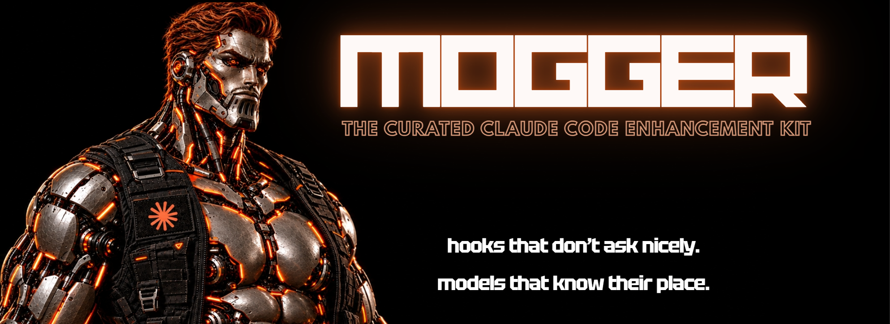

<div align="center">



<br/>
<br/>

**Most "Claude enhancer" repos are a prompt that says "be a senior engineer" and a hope.**
**This one is a bash script that says no and means it.**

[](tests/)
[](LICENSE)
[](CURATION.md)

</div>

---

Every claim in this kit is backed by an exit code, a benchmark you can
re-run, or a diff you can read — not a testimonial. Everything that didn't
clear that bar is in [CONSIDERED.md](CONSIDERED.md), with the reason,
instead of quietly not existing. That's the whole pitch: the internet is
full of "make Claude 1000x better" threads that are 80% noise. This is the
20%, with receipts, and it doesn't ask your model nicely — it puts a bash
script between it and anything that can't be undone.

## What this actually does


No config file makes the model smarter. What a kit *can* do, and what this
one does:

1. **Enforce discipline the model won't apply on its own.** Tests must
   actually pass — full suite, checked by exit code, not by the model
   saying so — before review. Scope creep is blocked at the tool call: a
   builder cannot edit a file the current task didn't declare. A "done
   when" condition that's a real check, not an adjective.
2. **Hard-gate anything irreversible.** `git push`, merges, deploys, and
   anything touching money are blocked at the tool-call level by hooks —
   no prompt, no agent, no clever reasoning gets around a bash script that
   returns exit code 2.
3. **Feed it current facts, not stale memory.** Context7 (bundled) for
   version-specific library docs. A `library-scout` agent that checks
   whether a good library already exists before anyone hand-rolls date
   math — and is explicitly allowed to answer "write it yourself," because
   a scout that always recommends a dependency is how you end up with
   forty packages for forty one-liners. A STACK.md so those choices are
   made once and stay consistent.
4. **Cut waste.** Every agent has a `model:` assignment: Haiku reads
   files, greps the codebase, and runs tests; Sonnet builds, reviews, and
   scouts libraries; only the orchestrating Lead needs a frontier model.
   The four Haiku agents also set `effort: low` — a second, independent
   dial on reasoning depth, documented as a real subagent frontmatter
   field. Model aliases (`model: sonnet`) resolve to whatever's current
   automatically, so a release like Sonnet 5.5 upgrades every Sonnet-tier
   agent with zero file changes, at the prior model's price. The Lead is
   told, in writing, not to Read or Grep itself. Then: diff-only re-reads
   (never re-read a file you just edited — read `git diff`), cache-aware
   prompt ordering (stable content first, so the prefix bills at ~10%),
   and output-token discipline (no preambles, no re-printing unchanged
   code). Optional compression proxy (headroom) for heavy tool output.
5. **Remember corrections.** CONSTRAINTS.md is a permanent, append-only
   home for every "don't do that again." A `retro` agent proposes new
   entries from run history; a human approves them.
6. **Auto-format on every edit.** A PostToolUse hook runs the project's
   own formatter/linter (prettier, ruff, gofmt, rustfmt, etc.) on each
   file Claude touches. Clean code isn't a prompt instruction, it's a
   hook.
7. **Run independent work at the same time.** `planner` marks which tasks
   have non-overlapping file sets; the Lead dispatches those builders
   concurrently instead of one-at-a-time. Tests follow the same logic —
   affected tests during the loop, full suite once before review.

## What's in the box

```
.claude-plugin/         plugin.json + marketplace.json — install with two slash commands
.mcp.json               bundles Context7 as a hosted remote MCP server — auto-registers on install
agents/                 planner, builder, reviewer, retro, library-scout (Sonnet) · tester, explorer, bulk-reader, code-writer (Haiku)
hooks/hooks.json        20 hook entries: SessionStart, PreToolUse, PostToolUse, Stop
hooks/scripts/          the actual bash — every one tested in tests/hooks.test.sh
skills/mogger-loop     the orchestration loop + model routing (loads when you start a feature)
skills/mogger-standards coding principles, library rules, token discipline, SkillSpector rule
skills/mogger-init     first-run: scaffolds CONSTRAINTS/RUNS/STACK in your project
skills/mogger-superpowers-preset  tested config for running these gates under Superpowers
templates/              the three project files above, plus pricing.json for the savings estimate
tests/*.test.sh         399 assertions across 6 suites (`for t in tests/*.test.sh; do bash $t; done`). If these fail, the gates don't work.
scripts/savings-report.py  optional: estimated cost avoided by model routing (self-reported, see below)
incoming/               manual-install mirror (generated by scripts/sync-incoming.sh)
CURATION.md             the rubric — what earns a place
CONSIDERED.md           every tool evaluated, with verdicts
INTEGRATION.md          manual merge guide for projects with an existing .claude/
```

## Install

**As a plugin (recommended):**

```
/plugin marketplace add <your-github-user>/claude-mogger
/plugin install mogger@claude-mogger
```

Then in any project, once: ask Claude to **"run mogger init"**. It
scaffolds CONSTRAINTS.md / RUNS.md / STACK.md, fills what it can from your
dependency files, checks `jq` or `python3` is present, auto-installs
SkillSpector if `uv` is available, and tells you exactly what's now
gated. Context7 is already live at this point — it registered as part of
plugin install, nothing to do for it. Nothing else to configure.

**Manually (if you'd rather have the files in your repo, or already have a
`.claude/` you want to merge into):** the `incoming/` folder mirrors the
plugin in project-relative shape. Drop the repo in your project root and
tell Claude Code: *"Read INTEGRATION.md and install this kit."* It handles
both fresh projects and existing setups.

**Try before you install:** `claude --plugin-dir /path/to/claude-mogger`

**Requirements:** `jq` (recommended — install with `winget install jqlang.jq`
on Windows, `brew install jq` on Mac, or your package manager on Linux) or a
real `python3`. bash native on macOS/Linux; on Windows use Git Bash (comes
with Git for Windows) — the tests and hooks both run fine there once `jq`
is installed. **Watch out on Windows:** `python3` often exists on PATH as a
Microsoft Store stub that prints an install nag instead of running —
`lib.sh` detects and ignores that stub, but installing `jq` sidesteps the
question entirely and is the more reliable path.

## The companion suite — for the person who is vibing, not reading diffs

Same rule as everything else here: each piece is a script with an exit code
or a file you can open. Nothing is "the model promises."

| Need | What it is | Enforced by |
|---|---|---|
| **Undo anything** | `checkpoint.sh` snapshots your work before edits (non-destructive git refs). `scripts/mogger-rewind.sh list/show/restore` — restore snapshots first, so undo is undoable. Skill: `mogger-rewind` | hook |
| **No leaked secrets** | `secret-guard.sh` blocks keys/tokens/`.env` writes; `secret-guard-bash.sh` blocks `git add .env` and commits with secrets staged | hook (exit 2) |
| **No invented packages** | `verify-packages.sh` checks every `npm/pip/cargo/go` install name exists on the real registry. Fails open offline | hook (exit 2 on 404) |
| **No made-up code references** | `check-references.sh` checks that new imports resolve to real files and declared dependencies | hook (exit 2) |
| **No guessing** | `mogger-grounding` skill: every claim cites `file:line` or command output, unchecked things are labeled `UNVERIFIED:`. `fact-checker` agent (Haiku) returns VERIFIED / REFUTED / UNVERIFIABLE with evidence. Reviewer and builder require it | skill + agents + hook |
| **Does it actually run?** | `scripts/smoke-check.sh` starts the app, polls it, scans for errors, writes `.claude/state/smoke.json`. Optional gate: `MOGGER_REQUIRE_SMOKE=on`. Agent: `verifier` | script + optional hook |
| **Ship checklist** | `scripts/ship-check.sh` — report only, never pushes or deploys | script |
| **Plain English** | `explainer` agent (Haiku): what changed, why, how to check, what to watch out for | agent |
| **Live status** | `STATUS.md` regenerated on every edit and stop (when `TASKS.md` exists) | hook |
| **Budget cap** | `MOGGER_BUDGET_USD=5` — cost computed from real transcript token counts x `templates/pricing.json`; warns at 80%, blocks at 100%. Off by default | hook |
| **Spec first** | `mogger-idea` skill: at most 5 short questions with defaults, never asks what the repo already answers, writes `SPEC.md` with checkable "done when" | skill |
| **Remember why** | `DECISIONS.md` append-only log, active decisions injected at session start, edits to old entries blocked | hook + skill |

The cost figure is an estimate (token counts x published rates), and
`check-references.sh` is conservative on purpose — it would rather miss
than cry wolf. Limits of each are in the script headers.

## What the hooks enforce — the part that doesn't depend on the model behaving

| Hook | Event | Blocks |
|---|---|---|
| `require-approval` | Bash | `git push`, merge while on main/master/prod, `gh pr merge`, prod deploys, money CLIs |
| `scope-guard` | Edit/Write | editing any file the current task's `files:` list didn't declare |
| `protect-pipeline-files` | Edit/Write | CI configs, Dockerfiles, Terraform, payment code |
| `require-tests-pass` | Task→reviewer | review without a *recorded* exit-0 **full-suite** run, or with edits since |
| `stop-done-means-done` | Stop | ending the turn with open tasks and no `BLOCKED:` reason |
| `check-file-size` / `check-bash-read` | Read / Bash | reading >350-line files directly (→ bulk-reader on Haiku) |
| `session-start` | SessionStart | — injects CONSTRAINTS.md, STACK.md, task status into context |
| `auto-format` | Edit/Write (post) | — runs your project's own formatter/linter on the touched file |

Protected branches default to `main|master|prod|production|release/.*`;
override with `MOGGER_PROTECTED_BRANCHES`. Reviewer agent name defaults to
`reviewer`; override with `MOGGER_REVIEWER_NAME` if you use Superpowers or
your own. Scope enforcement can be turned off with
`MOGGER_SCOPE_GUARD=off` — it fails open anyway when a task declares no
`files:` list, so it never wedges a session on a half-written task board.

## Bundled — no separate install

These two used to be a manual step. They're not anymore:

| Tool | How it's included | Status |
|---|---|---|
| [Context7](https://github.com/upstash/context7) | `.mcp.json` at the plugin root, pointed at Context7's hosted remote server | Live the moment the plugin installs. No npx, no local server, nothing to run. |
| [SkillSpector](https://github.com/NVIDIA/SkillSpector) | `mogger-init` detects it's missing and runs `uv tool install` itself | Installed the first time you run "mogger init" (needs `uv` on the machine — if `uv` itself is missing, init tells you the one command for that instead). |

## Recommended companions (external, install separately)

These two are genuinely optional and overlap with something already in the
kit — install them only if you want to swap in the more mature version:

| Tool | Why | Overlaps with |
|---|---|---|
| [headroom](https://github.com/headroomlabs-ai/headroom) | Local compression proxy; reversible; `headroom wrap claude` | `check-file-size.sh`/`check-bash-read.sh` on big-file reads only — `bulk-reader`/`explorer`/`code-writer`/`tester` stay regardless, they route by model not by compression |
| [Superpowers](https://github.com/obra/superpowers) | Mature brainstorming/TDD/git-worktree workflow — **better than this kit at planning and TDD** | this kit's `planner`/`builder`/`reviewer`; keep every hook. There's a tested preset for the combination — see below |

Details and the one-adjustment-each notes are in `CLAUDE.md.snippet`.

## Getting listed on a public marketplace

Two different things, often confused:

- **`claude-plugins-official`** — curated by Anthropic at their
  discretion. **There is no application process.** No form adds a plugin
  here; the community submission form explicitly does not. Nothing to do
  but build something worth curating.
- **`claude-community`** (`anthropics/claude-plugins-community`) — the
  public community marketplace, where third-party submissions land after
  review. This is the one you can actually submit to. Users add it with
  `/plugin marketplace add anthropics/claude-plugins-community`.

Submit via one of the in-app forms:

- claude.ai: `claude.ai/admin-settings/directory/submissions/plugins/new`
  — needs a Team/Enterprise org with directory-management access (org
  Owners have it by default)
- Console: `platform.claude.com/plugins/submit` — for individual authors
  without a Team/Enterprise org

Validate locally first; the review pipeline runs the same check plus
automated safety screening:

```
claude plugin validate .
claude plugin validate . --strict   # treat warnings as errors too
```

Approved plugins get pinned to a commit SHA in the community catalog, with
CI bumping the pin as you push. The catalog syncs nightly, so expect a lag
between approval and being installable.

Self-hosted install (`/plugin marketplace add <owner>/claude-mogger`)
works today and needs nobody's approval.

## Running this under Superpowers

Superpowers is better than this kit at planning, requirements-gathering,
and TDD enforcement. This kit is better at gates that can't be reasoned
around and at not paying frontier prices for file reads. Those are
different axes, so the answer is usually both.

The `mogger-superpowers-preset` skill is the tested configuration: which
mogger agents to stop dispatching, which to keep (all the hooks, all the
Haiku-routed agents, `library-scout`, `retro`), and the two config changes
it needs — `MOGGER_GATE_ALL_TASKS=on` so the test gate still fires against
subagent names you don't control, and a decision on `scope-guard`.

Why a preset and not a hard dependency: these hooks key off the tool call,
not off which skill triggered it. That's what makes them composable with
Superpowers, ECC, gstack, or nothing — and 13 assertions in
`tests/hooks.test.sh` verify the gates still fire when an
arbitrarily-named external agent is the caller. Vendoring Superpowers in
would trade that away for a fork to maintain.

Known rough edge, documented rather than hidden: on Windows, two plugins
each registering a `SessionStart` hook produces a cosmetic
`SessionStart:startup hook error` in Claude Code
([obra/superpowers#369](https://github.com/obra/superpowers/issues/369)) —
both hooks still run. The preset says what to do about it.

## Savings estimate (optional, self-reported — read the caveat)

`bash scripts/savings-report.py` reads `.claude/state/savings.jsonl` (the
four Haiku agents log their own approximate input/output size at the end
of each turn) and prints a table plus a `savings-dashboard.html`, showing
what those calls would have cost billed at your Lead model's rate instead
of Haiku's.

**What this is:** a disclosed calculation — output length × published
per-token price difference. Pricing lives in `pricing.json`, dated, one
edit away from current if rates drift.

**What this is not:** a comparison to a real session that ran without this
kit. No task here is ever run twice. The input/output sizes are self-
reported by the agent, not verified — a different trust tier than the
hooks table above, which check real exit codes and real branch names. The
terminal output and the dashboard both say this explicitly, every time.

For the number worth actually trusting, use RUNS.md's `tokens:` field —
that's a real `/cost` total for a task that actually happened.

## Run the tests

```
bash tests/hooks.test.sh
```

## Philosophy in one line

If a claim can't be verified by exit code, a benchmark with methodology,
or a diff you can read — it's not in here.

## License

MIT. Take it, fork it, get mogged.
